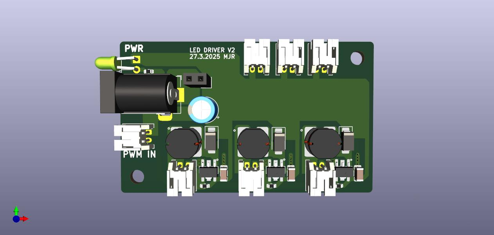
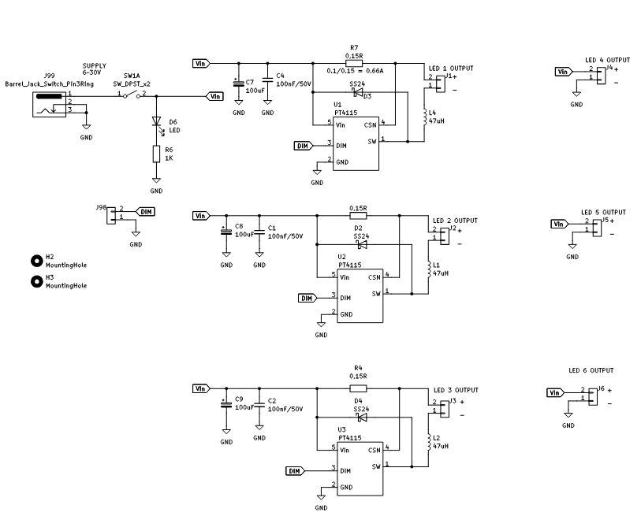
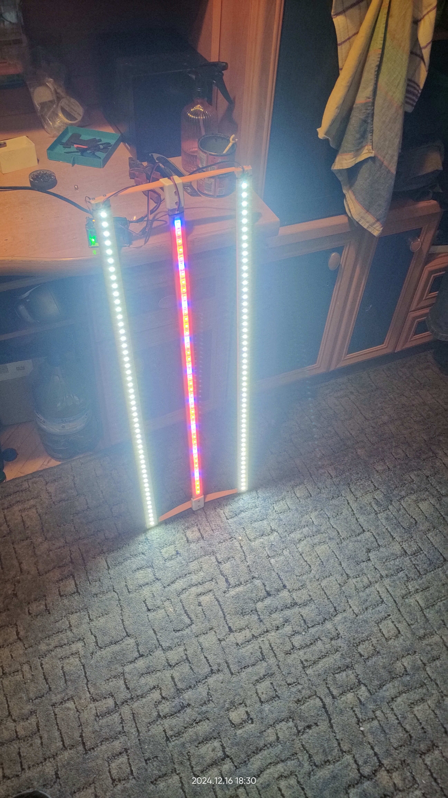
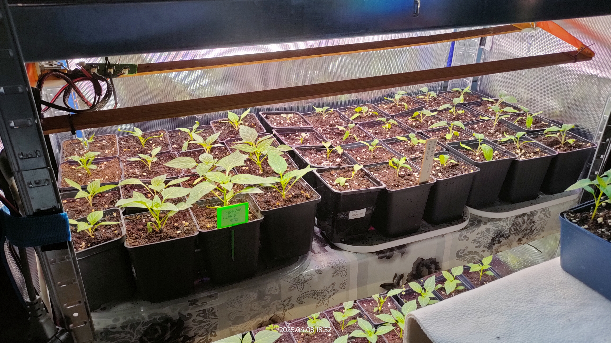

# LED driver PT4115 
Projekt sterownika LED przeznaczonego do sterowania lampą LED.
Dzięki możliwości regulacji mocy światła za pomocą sygnału PWM układ ma zastosowanie w doświetlaniu roślin na rozsadniku.

## 📷 Zdjęcia

## ⚙️ Użyte komponenty
- driver PT4115
- cewka 47uH
- dioda Schottkego SS24 1A
- kondesatory, rezystory
